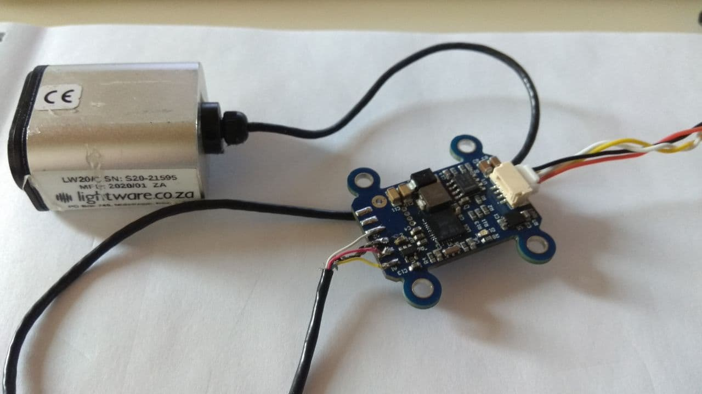
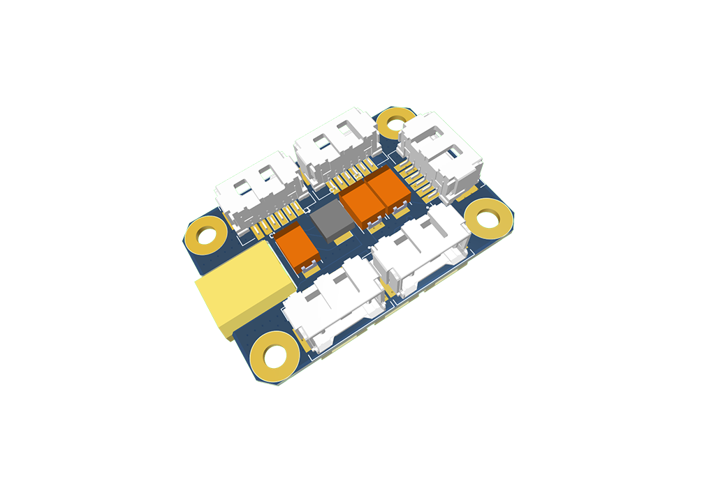
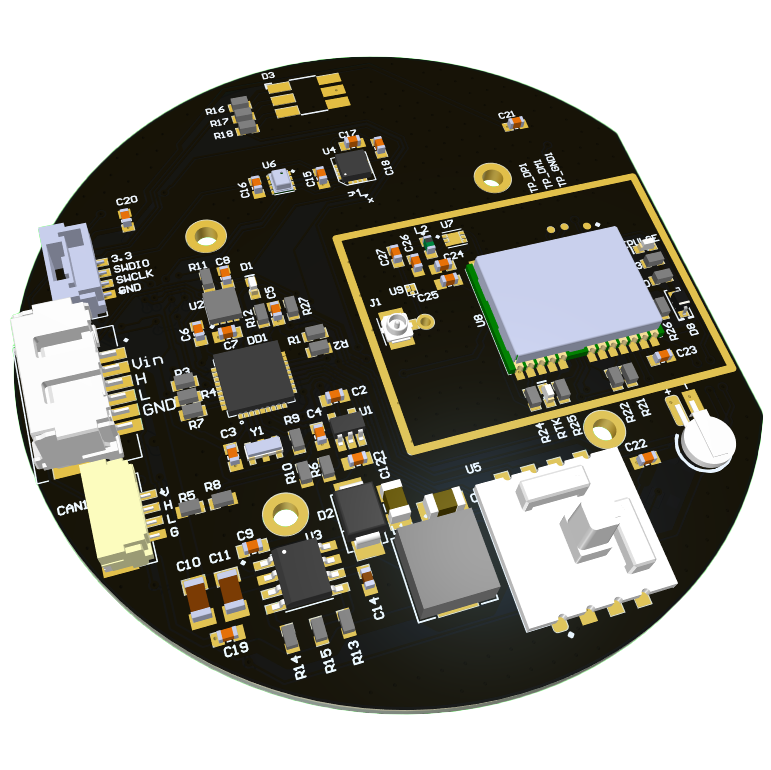
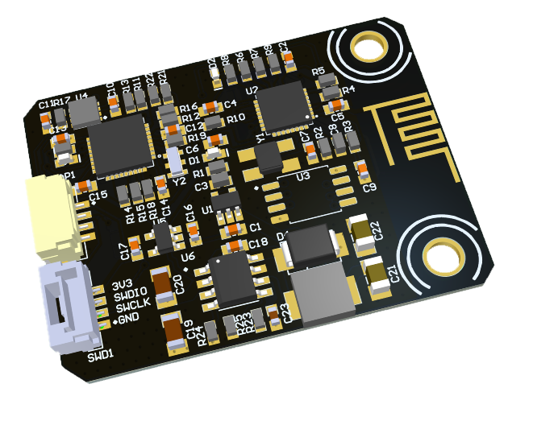
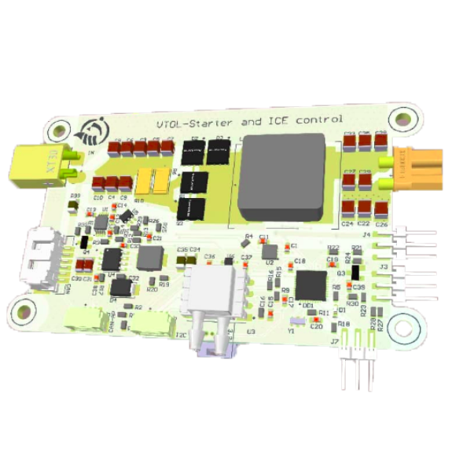
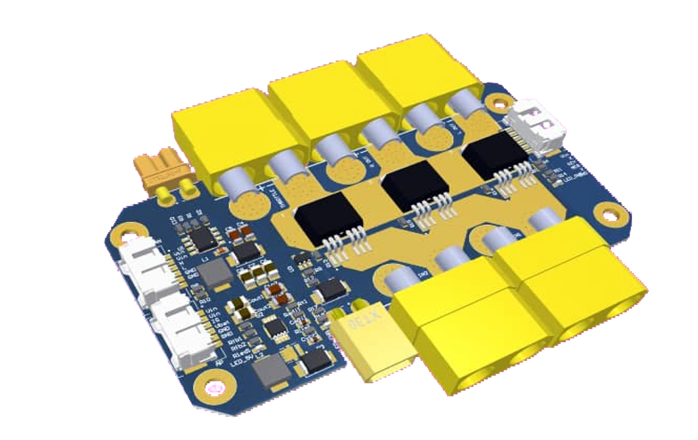

# Introduction

[DroneCAN](https://dronecan.github.io/)/[Cyphal](https://opencyphal.org/) (old name UAVCAN) nodes are devices primary based on CAN bus used by the PX4, ArduPilot and other projects as CAN peripherals devices.

This guide constains interface description, user manual and hardware specification for each developed devices. 

## PX4 compatibility

Primary our devices were tested with PX4 autopilot.

Check [official PX4 documentation](https://docs.px4.io/v1.12/en/uavcan/) for getting specic wire and settings instruction.

## Ardupilot compatibility

Check [official Ardupilot documentation](https://ardupilot.org/copter/docs/common-uavcan-setup-advanced.html) for getting specic wire and settings instruction.

## Existing devices

Following devices are already well tested and are being used in real applications multiple times:

### 1. Programmer-Sniffer

[Programmer sniffer](programmer_sniffer.md) is must-have device required for uploading firmwares to the nodes and monitoring CAN bus.

### 2. PWM-mini

[PWM-mini](can_pwm.md) is dedicated to controlling servos and ESCs. It supports 2 channels simultaneously. It has auxilliary pins which might be used as additional channels or for getting esc feedback.

### 3. PWM-nano

[PWM-nano](can_pwm.md) is dedicated to controlling servos and ESCs. It is smaller and chipier than PWM-mini because it doesn't have internal DC-DC. It supports 2 channels simultaneously.

### 4. Airspeed

[Airspeed](airspeed.md) is essential for fixed-wing UAV. It measure differential pressure that might be used for airspeed estimation.

### 5. Rangefinder

[Rangefinder](rangefinder.md) is used for precision landing.

### 6. CAN-mux

`CAN-mux` helps easily connect your devices and organize onboard network.

### 7. GPS-MAG-BARO

[GPS-MAG-BARO](gps_mag_baro.md) is the node that has 3 devices: GPS, magnetometer and barometer.

### 8. UI-LEDS

[UI-LEDS](ui_leds.md) adds light to your UAV: use visible LEDs to indicate the current vehicle status.

### 9. [testing stage] WiFi Sniffer

[WiFi Sniffer](wifi_bridge.md) allows wireless CAN-bus monitoring via WiFi/UDP.

### 10. [testing stage] Internal Combustion Engine controller

[Internal Combustion Engine controller](ice.md) is sophisticated board for controlling the internal combustion engine and starter.

### 11. [testing stage] PMU

[PMU](pmu.md) is power management unit for complext vehicles.

### 12. [dev stage] Charger

[Charger](charger.md) allows to automatically charge a battery.

### 13. [dev stage] Fuel Tank

[Fuel Tank](fuel_tank.md) is higly recommended for VTOL based on internal combustion engine. It estimates the current level and consumption of fuel.

### 14. [dev stage] Inclinometer

`Inclinometer` estimates his own orientation based on IMU sensors.
