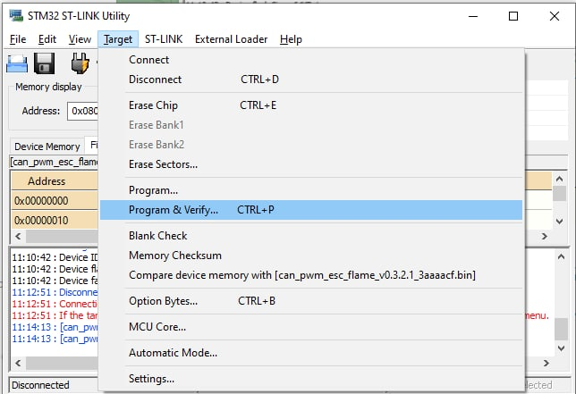
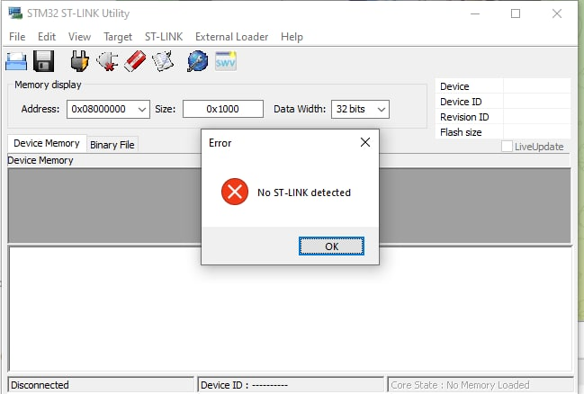

# UAVCAN Sniffer and Programmer

UAVCAN sniffer and programmer has two devices on one board:
- USB-UAVCAN adapter to connect your PC to UAVCAN bus with SLCAN for real-time monitoring of CAN bus and UAVCAN transfer dissection with [uavcan_gui_tool](https://github.com/UAVCAN/gui_tool)
- SWD programmer to update the firmware of your UAVCAN nodes.

This device is mainly intended for developers in robotics (UAV, UGV, AUV, USV, etc.), working with UAVCAN and PX4/Ardupilot. But it might be used for sniffing CAN-bus and programming other microcontroller as well.


## 1. Hardware specification

Schematic represented in [this repo](https://github.com/sainquake/UAVCAN-Sniffer-STM-Programmer), and PDF version is [here](https://github.com/sainquake/UAVCAN-Sniffer-STM-Programmer/blob/master/Project%20Outputs%20for%20CAN_SNIFFER/Output.PDF)


## 2. Wire

This board has 4 connectors which are described in the table below.

| № | Connector | Description |
| - | --------- | ----------- |
| 1 | USB Type-C | Dedicated for connection with PC |
| 21 | UCANPHY Micro (JST-GH 4) | Devices that deliver power to the bus are required to provide 4.9–5.5 V on the bus power line, 5.0 V nominal. Devices that are powered from the bus should expect 4.0–5.5 V on the bus power line. The current shall not exceed 1 A per connector. |
| 3 | 6-pin Molex  ([502585-0670](https://www.molex.com/molex/products/part-detail/pcb_receptacles/5025850670), [502578-0600](https://www.molex.com/molex/products/part-detail/crimp_housings/5025780600)) | Contacts support up to 100 V, 2 A per contact. But the board may work only with 2S-6S. |
| 4 | SWD | STM32 firmware updating using [programmer-sniffer](docs/guide/programmer_sniffer/README.md). |


:::warning
Be careful, 4-pin CAN and SWD connectors look similar, but the wrong connection may cause some problems. Names of these connectors are marked on the backside of the board.
:::


## 3. Programmer usage

You may program your devices in any way you want. The easiest way in our opinion is to use st-link utility.

The example of connection is shown below.


Fig. Example of SWD connection with can-mini node

:::warning
SWD and CAN sockets look similar and they use the same 4-pin cable. Don't mix them up. Check the right one on the bottom side of the device.
:::

:::warning
Be sure that your SWD pins are connected correctly (3.3 to 3.3, GND to GND)
:::

:::warning
On the sniffer `VUSB` led should be orange, `3.3` led should be red, `ST-link` led should be blue, and `blink` led should blink with yellow. If they are not, probably you are making something wrong. It also may indicate that the board works incorrectly.
:::

:::warning
If your node already has a correct firmware, after such connection it should blink. If it is not, probably the firmware is wrong or the connection is mistaken.
:::

You can get the desired firmware on [the release section](https://github.com/InnopolisAero/inno_uavcan_node_binaries/releases) 

### 3.1. Windows

1. Install `ST-LINK utility` from [the official site](https://www.st.com/en/development-tools/stsw-link004.html)
2. Open `ST-LINK utility`, connect the programmer to the PC via USB
3. Connect target device to the programmer via SWD connectors as shown on the picture above with respect to the warnings. If you gen an error, check the [Windows issues](#311-windows-issues) section.

4. Choose option `Target -> Connect`. Device should be successfully connected. If you get an error, check the issues below.


5. You should see `Device ID` if everything fine (as shown in picture below)


6. Choose `file -> open file ...` and navigate to the downloaded firmware .bin as shown in the pictures below


7. Choose `Target -> Program & Verify ... CTRL+P`



8. Wait until downloading is in progress


9. You should see `Verification...OK` if everythin is ok.


At that point, the firmware is succesfully downloaded. You can verify the software version by using `gui_tool`.

#### 3.1.1. Windows issues

Wrong connection may leds to one of 2 following errors:

1. Can not connect to target


Programmer is succesfully detected, but your device is not detected via SWD by the programmer. Either SWD connection is not ok, or there is a problem on the target side.

```
Sometimes it may happend that the 3.3 and GND is connected, but SWDIO and SWCLK are not ok enough. In this case the node blinks because it has a power, but connection is not stable enough to start a programming. Just make more tention by pushing jumpers a little bit and then press `Program & Verify` one more time. 
```

2. No ST-LINK detected



Either your programmer is not connected to your PC, or it is broken. Check the leds on the programmer device.

### 3.2. Linux

1. Install `st-link` using [the instruction from the official GitHub repository](https://github.com/stlink-org/stlink#installation)
2. Type the following to program your device with desired .bin file:

```bash
st-flash write desired_bin_file.bin 0x8000000
```

where `desired_bin_file.bin` is the name of the binary file.

## 4. Sniffer usage

You need to connect `programmer-sniffer` with your UAVCAN node via CAN socket and with your PC via USB.

There are 2 different CAN sockets. You can use any of them.

```
Be careful, don't use SWD instead of CAN socket!
```

After that, you can use [uavcan_gui_tool](https://github.com/UAVCAN/gui_tool) utility or something other.


In the Application Setup menu you need to set `1000000` to both can bus and adapter baud rates.

After that you will get following window:


## 5. Led indication

(in progress)

## 6. Application examples

As an example, this device might be suitable for such applications as [UAVCAN HITL simulation](https://github.com/InnopolisAero/innopolis_vtol_dynamics).


